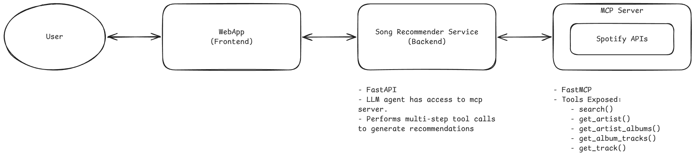

# Song Recommender

A conversational song-recommendation system. The user chats about artists, albums, tracks, or
moods they like; an LLM agent composes Spotify API calls to recommend songs.

```
React (Vite)  ──SSE──▶  FastAPI + LangGraph agent  ──MCP (streamable-http)──▶  FastMCP ──▶ Spotify Web API
  frontend/                      backend/                                       mcp_server/
```

See **[PLAN.md](PLAN.md)** for the full architecture review, design decisions, and the live
progress checklist.

## Why the agent composes calls (important)

Spotify deprecated most of the "easy" discovery endpoints (Nov 2024) — `/recommendations`,
artist top-tracks, related-artists, audio-features, browse playlists, and batch lookups are all
unavailable to a new app. So **`search`** (with `genre:` / `year:` / `artist:` filters) is the
backbone, and the agent makes **multiple tool calls** to assemble recommendations.

The routing is encoded in the agent's system prompt
([backend/app/prompts.py](backend/app/prompts.py)), which decides what the user actually wants
before it calls anything:

- **an emotion/weather mood** → `mood_to_genres` → `genres_to_artists` → `artists_to_tracks`
- **"songs *by* X"** → `artists_to_tracks(["X"])` directly — never via genres, or you hand them
  somebody else's music
- **"songs *like* X"** → the LLM picks genres for X itself → `genres_to_artists` → `artists_to_tracks`
- **a language/region** ("hindi songs") → the LLM picks region terms *and* sets `market` to that
  country's ISO code → `genres_to_artists(..., market="IN")` → `artists_to_tracks`

The "like X" case is LLM-side because **Spotify no longer exposes an artist's genres** —
`get_artist` returns them empty, so no tool can supply them. The terms it may pick from are the
categorized `VETTED_VOCAB` ([backend/app/genres.py](backend/app/genres.py)) — grouped by
**genre / mood / region / scene**, with a flat `VETTED_GENRES` derived from it. Spotify's
`available-genre-seeds` endpoint is gone, so that vocabulary is built empirically by
[scripts/validate_genres.py](scripts/validate_genres.py), which probes each candidate as a
`genre:"…"` search and keeps the ones that return relevant results. Emotion and weather words
(*happy*, *sad*, *rainy*) **don't** work as `genre:` filters — Spotify name-matches them and
returns junk — so `MOOD_GENRES` / the `mood_to_genres` tool translate those onto real genres instead.

## Architecture at a glance



Three independent services. The MCP server owns *all* Spotify access, so the backend never
touches Spotify directly and stays portable.

1. **`mcp_server/`** — a [FastMCP](https://github.com/modelcontextprotocol) server that wraps the
   Spotify Web API and exposes a handful of read-only tools over `streamable-http` at `/mcp`.
   Handles Spotify auth (Client Credentials), token caching, 429 rate-limit backoff, and trims
   bulky Spotify payloads into compact dicts.
2. **`backend/`** — a FastAPI app that builds a LangGraph ReAct agent once at startup. On each
   request it streams the agent's run as Server-Sent Events. The agent's tools are the MCP
   server's tools, loaded via `langchain-mcp-adapters`. The LLM provider is swappable by config.
3. **`frontend/`** — a React/Vite chat UI that POSTs to `/chat`, renders the streamed tokens as
   Markdown, and persists a `session_id` for multi-turn memory.

### Request flow

```
User types in the React UI
  └─▶ POST /chat { session_id, message }                         (frontend/src/api.js)
        └─▶ Backend resolves agent from app.state, streams astream_events
              ├─ on_chat_model_stream  ─▶ SSE "token"
              ├─ on_tool_start          ─▶ SSE "tool_start"  ─┐
              ├─ on_tool_end            ─▶ SSE "tool_end"      │  tool call goes:
              └─ done / error           ─▶ SSE "done"/"error"  │  agent ─▶ MCP client
                                                               └─▶ MCP server ─▶ Spotify
```

Conversation memory is held by an in-memory `MemorySaver` checkpointer keyed by
`thread_id = session_id`. It lives for the lifetime of the backend process; swap it for a
persistent checkpointer (e.g. `SqliteSaver`/`PostgresSaver`) for production.

## Prerequisites

- Python 3.12+, Node 20+
- A Spotify app (free): https://developer.spotify.com/dashboard → copy the **Client ID** and **Client Secret**
- An LLM provider key (default OpenAI: `OPENAI_API_KEY`)

## Run locally (three terminals)

### 1. MCP server
```bash
cd mcp_server
python -m venv venv && . venv/Scripts/activate   # Windows; use venv/bin/activate on macOS/Linux
pip install -r requirements.txt
cp .env.example .env        # then fill in SPOTIFY_CLIENT_ID / SPOTIFY_CLIENT_SECRET
python server.py            # serves MCP at http://localhost:8001/mcp
```

### 2. Backend
```bash
cd backend
python -m venv venv && . venv/Scripts/activate
pip install -r requirements.txt
cp .env.example .env        # then fill in OPENAI_API_KEY
uvicorn app.main:app --reload --port 8000
```

### 3. Frontend
```bash
cd frontend
npm install
cp .env.example .env
npm run dev                 # http://localhost:5173
```

Open http://localhost:5173 and chat.

## Run with Docker
```bash
# create the two backend/.env and mcp_server/.env files first (from the examples)
docker compose up --build
```

`docker-compose.yml` wires the three services together and overrides `MCP_URL` so the backend
reaches the MCP server by its compose service name (`http://mcp_server:8001/mcp`).

## Deploy to Render

All three services deploy to [Render](https://render.com) from one
[`render.yaml`](render.yaml) Blueprint: the frontend as a free **Static Site** (always-on), the
backend and MCP server as free **Docker web services**.

1. Push this repo to GitHub, then in Render pick **New → Blueprint** and connect it.
2. When prompted, fill the secrets Render can't infer: `SPOTIFY_CLIENT_ID` /
   `SPOTIFY_CLIENT_SECRET` (MCP) and `OPENAI_API_KEY` (backend).
3. Apply. Render builds MCP → backend → frontend using the `MCP_URL`, `CORS_ORIGINS`, and
   `VITE_API_BASE_URL` values in the Blueprint.

Smoke-test the deployed backend (use your backend's actual hostname):
```bash
curl https://song-recommender-backend-tt5c.onrender.com/health          # {"status":"ok"}
curl -N -X POST https://song-recommender-backend-tt5c.onrender.com/chat \
  -H "Content-Type: application/json" \
  -d '{"session_id":"smoke-1","message":"Recommend songs like Tame Impala"}'
```

To confirm the frontend bundle points at the right backend after a redeploy:
```bash
js=$(curl -sS https://song-recommender-frontend.onrender.com/ | grep -oE '/assets/[^"]+\.js' | head -1)
curl -sS "https://song-recommender-frontend.onrender.com$js" \
  | grep -oE 'https://song-recommender-backend[a-z0-9-]*\.onrender\.com' | sort -u
# expect: https://song-recommender-backend-tt5c.onrender.com
```

## Configuration

Each service reads a `.env` file (copy from its `.env.example`). Config is loaded via
`pydantic-settings`.

### `backend/.env`

| Variable        | Default                      | What it does                                                        |
|-----------------|------------------------------|---------------------------------------------------------------------|
| `LLM_PROVIDER`  | `openai`                     | Provider passed to `init_chat_model` (see swap table below).        |
| `LLM_MODEL`     | `gpt-4o`                     | Model id for that provider.                                         |
| `OPENAI_API_KEY`| —                            | Standard key var for whichever provider you chose.                  |
| `MCP_URL`       | `http://localhost:8001/mcp`  | Where the backend finds the MCP server.                            |
| `CORS_ORIGINS`  | `http://localhost:5173`      | Comma-separated allowed origins (the Vite dev server).             |
| `LOG_LEVEL`     | `INFO`                       | Root log level.                                                     |
| `TURN_LOG_ENABLED` | `true`                    | Write per-turn records to `logs/turns.jsonl` (see below).           |

### `mcp_server/.env`

| Variable                | Default   | What it does                                  |
|-------------------------|-----------|-----------------------------------------------|
| `SPOTIFY_CLIENT_ID`     | —         | From your Spotify app dashboard.              |
| `SPOTIFY_CLIENT_SECRET` | —         | From your Spotify app dashboard.              |
| `MCP_HOST`              | `0.0.0.0` | Bind host for the FastMCP server.             |
| `MCP_PORT`              | `8001`    | Bind port; the MCP endpoint is `/mcp`.        |
| `LOG_LEVEL`             | `INFO`    | `DEBUG` adds a line per Spotify HTTP request. |
| `ARTISTS_PER_GENRE`     | `10`      | Artists fetched per genre by `genres_to_artists`. |
| `TRACKS_PER_ARTIST`     | `10`      | Tracks fetched per artist by `artists_to_tracks`. |
| `DISCOVERY_CONCURRENCY` | `8`       | Max concurrent Spotify calls in a fan-out.    |
| `MAX_GENRES_PER_CALL`   | `4`       | Caps fan-out if the agent passes a long genre list. |

The last four bound both breadth and load on the batched tools; tool arguments override them per
call, so they are the defaults an operator can retune without a code change.

### `frontend/.env`

| Variable             | Default                  | What it does                          |
|----------------------|--------------------------|---------------------------------------|
| `VITE_API_BASE_URL`  | `http://localhost:8000`  | Backend base URL the UI calls.        |

## Swapping the LLM provider

Change two env vars in `backend/.env` (and install that provider's integration package):

| Provider  | `LLM_PROVIDER` | `LLM_MODEL`           | Package              | Key env var         |
|-----------|----------------|-----------------------|----------------------|---------------------|
| OpenAI    | `openai`       | `gpt-4o`              | `langchain-openai`   | `OPENAI_API_KEY`    |
| Anthropic | `anthropic`    | `claude-opus-4-8`     | `langchain-anthropic`| `ANTHROPIC_API_KEY` |
| Ollama    | `ollama`       | `llama3.1`            | `langchain-ollama`   | (local)             |

No agent code changes — the provider factory in [backend/app/llm.py](backend/app/llm.py) is the
only swap point (it calls `init_chat_model`, which resolves the right LangChain integration from
`LLM_PROVIDER`).

## HTTP API reference

The backend exposes two endpoints.

### `GET /health`
Liveness check. Returns `{"status": "ok"}`.

### `POST /chat`
Runs one agent turn and streams the result as **Server-Sent Events** (`text/event-stream`).

Request body:
```json
{ "session_id": "uuid-string", "message": "Recommend songs like Tame Impala" }
```

`session_id` is the conversation key — reuse it across turns to keep memory; use a fresh one to
start clean. SSE event types emitted (see [backend/app/routes/chat.py](backend/app/routes/chat.py)):

| Event        | `data` payload                  | Meaning                                  |
|--------------|---------------------------------|------------------------------------------|
| `token`      | `{ "text": "..." }`             | An LLM text delta (stream these to UI).  |
| `tool_start` | `{ "name": "...", "input": … }` | The agent invoked a Spotify MCP tool.    |
| `tool_end`   | `{ "name": "..." }`             | That tool finished.                      |
| `done`       | `{}`                            | The turn completed.                      |
| `error`      | `{ "message": "..." }`          | A failure, surfaced instead of dropping. |

## MCP tools reference

Defined in [mcp_server/tools.py](mcp_server/tools.py). Only **non-deprecated** Spotify endpoints
are exposed. Every tool also accepts an optional `user_token` — unused in Phase 1 (Client
Credentials), present so Phase-2 per-user OAuth is purely additive. All tools return normalized
dicts (see [mcp_server/spotify/normalize.py](mcp_server/spotify/normalize.py)).

The first three are **batched**: each takes a list and fans the Spotify calls out concurrently,
so one tool call covers a whole genre or artist list. That matters — driven one-at-a-time, a
single mood request would be ~44 sequential calls and therefore ~44 LLM roundtrips.

| Tool                 | Args                                | Returns / use                                                                 |
|----------------------|-------------------------------------|-------------------------------------------------------------------------------|
| `genres_to_artists`  | `genres[]`, `per_genre`, `market`   | Artists in those genres/regions. One `type=artist,track` search per term: takes the directly-tagged artists, then tops up from the track block, which is the only source that works for the ~1/3 of vetted tags where `type=artist` returns nothing. `market` (ISO country code) biases results to that catalogue — set it for a region request, alongside the region term. |
| `artists_to_tracks`  | `artists[]`, `genre`, `year`, `market`, `per_artist` | Tracks for those artists, deduped and interleaved so consecutive tracks differ by artist. Also serves "songs **by** X" directly. `market` (ISO country code) biases to that catalogue. |
| `album_to_tracks`    | `album` (name)                      | Every track on a named album.                                                 |
| `search`             | `query`, `type` (`track`/`artist`/`album`), `limit` (max **10**), `market` | Resolver — e.g. which artist recorded a named track. Filters go in `query`: `artist:"…"`, `genre:"…"`, `year:2018-2024`. `market` is an optional ISO country code. |
| `get_artist`         | `artist_id`                         | Single artist. **`genres`/`popularity` come back empty** — Spotify removed them. |
| `get_artist_albums`  | `artist_id`, `limit` (max **10**)   | Albums + singles, to dig into a seed artist's catalogue.                      |
| `get_album_tracks`   | `album_id`, `limit`                 | An album's tracks (simplified; omits the album name).                        |
| `get_track`          | `track_id`                          | Full detail for one track (album name, duration).                            |

`mood_to_genres` is a **local** backend tool ([backend/app/local_tools.py](backend/app/local_tools.py)),
not an MCP one — it translates emotion/weather words (which fail as `genre:` filters) onto real
`VETTED_GENRES` without touching Spotify, so it lives beside the genre list rather than being
duplicated into a separately-deployed service.

Auth, retry/backoff and payload trimming live in [mcp_server/spotify/](mcp_server/spotify/).

## Testing — tool-call evaluation

There is **no unit-test suite and no linter configured** — don't go looking for `pytest` or
`npm run lint`. What exists is one end-to-end harness.

[tests/run_tool_eval.py](tests/run_tool_eval.py) checks **which** Spotify tools the agent decides to
call. It POSTs each prompt in [tests/test_prompts.jsonl](tests/test_prompts.jsonl) to a running
backend and tallies the `tool_start` events — it doesn't instrument the agent, it just listens to
the SSE stream. Each prompt gets a fresh `session_id` so memory can't leak between cases. The 15
prompts carry `expected_tools` annotations across four categories: `none` (off-topic → 0 tools),
`routing` (10 cases: by-vs-like dispatch, moods, genres, albums), `batching` (one call, not a loop),
and `deep` (album/track exploration). It prints per-prompt counts and a summary, and **exits
non-zero only on transport failures, not on expected-vs-actual mismatches** — a report, not a gate.

Run it with **both servers up** and the backend venv active (for `httpx` + `httpx_sse`):
```bash
python tests/run_tool_eval.py
python tests/run_tool_eval.py --base-url http://localhost:8000 --prompts tests/test_prompts.jsonl
```

## Logging & observability

Both Python services log to the terminal **and** a rotating file (1 MB × 3 backups), configured
at import time so a bare `python server.py` / `uvicorn app.main:app` captures everything:

- Backend → `logs/backend.log` (project root, **not** `backend/logs/` — `uvicorn --reload`
  watches `backend/`, so a log file in there would restart the server on every write)
- MCP server → `mcp_server/logs/mcp.log`

`LOG_LEVEL` (default `INFO`) is honored by both services. Set it to `DEBUG` on the MCP server
for a line per Spotify HTTP request with path, params, status and latency; rate-limit backoff,
401 token refresh and retry exhaustion are logged at WARNING/ERROR regardless. The MCP server
also logs every tool invocation with its arguments (a `_log_call` helper in
[mcp_server/tools.py](mcp_server/tools.py)). Tokens are never logged anywhere — not the
`Authorization` header, not `user_token`, not the app token (only its expiry).

### Turn records

The backend also writes one JSON object per chat turn to `logs/turns.jsonl` — the complete
picture of a turn, which the line-based logs can't give you:

```json
{
  "turn_id": "20219971f17f", "session_id": "…", "duration_ms": 11422, "status": "ok",
  "llm": {"provider": "openai", "model": "gpt-4o"},
  "message": "melancholy chamber pop for a rainy evening",
  "answer": "…the full recommendation text…",
  "tool_calls": [{"name": "search", "input": {"…": "…"}, "output": [{"…": "…"}], "duration_ms": 2890}],
  "usage": {"input_tokens": 6188, "output_tokens": 476, "total_tokens": 6664},
  "error": null
}
```

Note `tool_calls[].output` — the Spotify results the agent actually reasoned over, recorded here
though deliberately *not* sent to the browser. On failure `status` is `"error"` and
`error.traceback` holds the full stack alongside whatever completed before it died; a turn is
recorded even if the client disconnects mid-stream. Records are written whole and never rotated, so
the file doubles as a replay dataset. It holds full user messages and model output, so it's an
explicit opt-out: `TURN_LOG_ENABLED=false`.

All `logs/` directories are git-ignored — and on Render they're ephemeral per-instance, so
this is a development and evaluation tool, not durable production analytics.

## Project layout

| Path          | What it is                                                             |
|---------------|-----------------------------------------------------------------------|
| `mcp_server/` | FastMCP server wrapping Spotify (Client Credentials, read-only tools). |
| `backend/`    | FastAPI + LangGraph ReAct agent, SSE chat, per-session memory.         |
| `frontend/`   | React/Vite streaming chat UI.                                          |
| `tests/`      | Tool-call evaluation harness + prompt suite.                          |
| `scripts/`    | Dev-time utilities, not runtime. Currently `validate_genres.py`.      |
| `CLAUDE.md`   | Orientation notes for Claude Code sessions.                           |

Key files within each service:

```
mcp_server/
  server.py            FastMCP init, logging, run(transport="streamable-http")
  tools.py             @mcp.tool definitions + the fan-out helpers (_pages/_gather/_items)
  spotify/client.py    async Spotify client (token inject, 429/401 handling)
  spotify/auth.py      Client Credentials token cache
  spotify/normalize.py trim Spotify payloads → compact dicts

backend/app/
  main.py              FastAPI app, CORS, logging, lifespan (builds agent once)
  llm.py               provider factory (init_chat_model) — single swap point
  agent.py             create_agent (ReAct) + MemorySaver
  prompts.py           RECOMMENDATION_AGENT_SYSTEM_PROMPT — the routing policy
  genres.py            VETTED_VOCAB (genre/mood/region/scene) + derived VETTED_GENRES + MOOD_GENRES
  local_tools.py       mood_to_genres — runs in-process, no Spotify call
  mcp_client.py        MultiServerMCPClient → LangChain tools
  turnlog.py           per-turn JSONL eval records
  routes/chat.py       POST /chat → SSE stream

frontend/src/
  App.jsx              chat UI (renders streamed Markdown)
  api.js               streamChat(): POST /chat, parse SSE
  hooks/useChat.js     session_id persistence + message state
  components/TrackCard.jsx   unused — staged for a future structured `tracks` event
```

Each service also has a `config.py` (pydantic-settings) and a `Dockerfile`; `docker-compose.yml`
and `render.yaml` at the root wire them together for local and deployed runs.

## Roadmap (Phase 2)

Per-user OAuth (Authorization Code + PKCE) to **create playlists in the user's account**. The
seams are already in place: every MCP tool accepts an optional `user_token`, and
`SpotifyClient` passes user tokens straight through (never caching them). See PLAN.md.